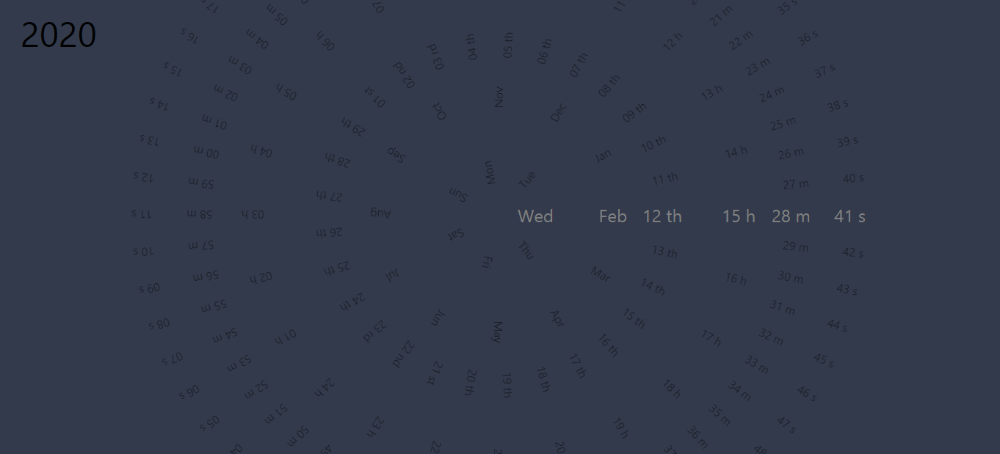

# **React Clock**

## Presentation

First React project.

Based on [this project](https://www.golangprograms.com/react-js-projects-for-beginners/react-js-compass-clock.html)

Acces [it here](https://debourgeo.github.io/ReactClock)

[x] Codebase formated by [Prettier](https://prettier.io/)

### **[React Clock](https://debourgeo.github.io/ReactClock)**

Consists in a clock made with react, which is updated every second, created dynamically thanks to a custom component.
Created using classes and functionnal components, to know what those are about, before switching to hooks.

## Contributors

-   [**Denis Bourgeois**](https://github.com/Debourgeo)

## (Feedback)

-   Not responsive as of now, no time for it just yet

## Langages

-   HTML
-   CSS
-   JS

## Framework

-   React

## Libraries

-   /

## State

In a good spot, needs more work for the responsive part

## Thanks

-   [BeCode](https://www.becode.org/).
-   The guy who had this idea originaly.
-   [Loïc Lissens](https://github.com/LoicLissens), for some CSS tips.
-   [Vincent Bouton](https://github.com/Vincent-bouton) and [Valeriya Kozlova](https://github.com/ValeriyaKozlova), for the "return" shenanigans.
